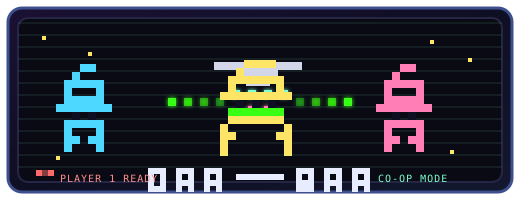

<p align="center">
  
</p>

# Bot Rider

**Turn one prompt into a team debate—then ship code you actually approved.**

Bot Rider is a VS Code extension that runs a **swarm of AI persona bots** through GitHub Copilot. Instead of a single agent jumping straight to patches, your bots **talk it out first**: propose, critique, synthesize, and decide—then propose workspace changes you review before anything hits disk.

No extra API keys. No mystery writes. Just Copilot, a room full of specialists, and you in the chair.

---

## Why Bot Rider?

Most coding agents treat disagreement as noise. Bot Rider treats it as the product.


| The usual agent                                 | Bot Rider                                                     |
| ----------------------------------------------- | ------------------------------------------------------------- |
| One model, one shot at the answer               | Multiple personas with roles, instructions, and @mentions     |
| Patches appear before you've seen the reasoning | Language-only debate first; implementation is a separate pass |
| "Trust me" apply                                | **You** pick files, inspect hunks, and Approve or Reject      |
| Side effects can pile up silently               | File edits and MCP actions are **separate review gates**      |


You get the speed of AI collaboration with the safety of a code review—inside the editor you already use.

---

## What you can do

- **Build a swarm** — Create bots with names, handles (`@alpha`), personas, and roles. Toggle who is active per run.
- **Run real debates** — Bounded proposal and critique rounds, synthesis, objections, and explicit **Continue**, **Pick**, or **Stop** when the room splits.
- **Plan work like a team** — Protected Spec and Dispatcher bots help shape tasks; dependency-ready workers run under a bounded scheduler.
- **See the whole picture** — Context Map, run board, OpenSpec trace chips, and local repository context keep prompts grounded in *your* repo.
- **Review before you ship** — Proposed Changes shows modified, added, and deleted files. Select what to include, preview validated hunks, regenerate stale patches, then apply atomically.
- **Stage MCP actions safely** — Mutating tools are discovered, staged, and executed only after you confirm—never mid-debate.
- **Pick up where you left off** — Reload the window and resume transcript, pending review, and staged actions when you need to.

---

## Quick start

### Install (users)

1. Download the latest `.vsix` from [GitHub Actions / release artifacts](https://github.com/praveeninbasekaran/bot-rider/actions) (or your team's release channel).
2. In VS Code: **Extensions** → **⋯** → **Install from VSIX…**
3. Reload VS Code, open the **Bot Rider** activity bar, and follow **Getting Started**.

Full setup, Copilot sign-in, and recovery: **[docs/INSTALL.md](docs/INSTALL.md)**

### Try it in 60 seconds

1. Open a workspace folder.
2. Open **Bot Rider** → **Swarm**.
3. Send a master prompt, e.g. *"Add input validation to the signup form and explain the tradeoffs."*
4. Watch the swarm debate, then open **Proposed Changes** when files appear.
5. Select the files you want, review diffs, and **Approve** or **Reject**.

Use `@handle` in the composer to lock a single bot for a direct turn.

---

## How it works

```
You send a prompt
       ↓
Swarm debates (language only — no silent file writes)
       ↓
Implementer proposes a changeset (JSON + unified hunks)
       ↓
You review in Proposed Changes → Approve selected files
       ↓
Workspace updates — honestly reported if anything fails
```

**Copilot-only.** Bot Rider uses `vscode.lm` with GitHub Copilot. It never asks for OpenAI, Anthropic, or other API keys.

**Host-owned control plane.** Scheduling, dependencies, cancellation, concurrency, and approvals are deterministic—not delegated to an LLM orchestrator.

**Local-first context.** Repository indexing and docs retrieval run on your machine by default.

---

## Requirements


|                    |                                                                                                                                                      |
| ------------------ | ---------------------------------------------------------------------------------------------------------------------------------------------------- |
| **Editor**         | Visual Studio Code `^1.99.0`                                                                                                                         |
| **AI**             | [GitHub Copilot](https://marketplace.visualstudio.com/items?itemName=GitHub.copilot) — required to **Send**, **Continue**, **Pick**, and **Recheck** |
| **API keys**       | None. Copilot sign-in is enough.                                                                                                                     |
| **Bot management** | Create, edit, toggle, and delete bots **without** Copilot                                                                                            |


---

## For contributors

```bash
git clone https://github.com/praveeninbasekaran/bot-rider.git
cd bot-rider
npm install
```

Press **F5** in VS Code to launch the Extension Development Host, open a workspace, and use Bot Rider from the activity bar.

```bash
npm test          # Vitest suite (no live Copilot calls)
npm run compile   # Typecheck
npm run release:gate   # Full release checks (when packaging)
```

See **[docs/INSTALL.md](docs/INSTALL.md)** for contributor details.

---

## Documentation


| Doc                                                                                        | What's inside                         |
| ------------------------------------------------------------------------------------------ | ------------------------------------- |
| [docs/INSTALL.md](docs/INSTALL.md)                                                         | VSIX install, Copilot setup, recovery |
| [docs/TROUBLESHOOTING.md](docs/TROUBLESHOOTING.md)                                         | Exact error messages and fixes        |
| [docs/architecture-mvp.md](docs/architecture-mvp.md)                                       | Architecture blueprint                |
| [docs/ui-ux-spec.md](docs/ui-ux-spec.md)                                                   | UI/UX specification                   |
| [docs/master_product_requirement_document.md](docs/master_product_requirement_document.md) | Product roadmap and constraints       |
| [openspec/specs.md](openspec/specs.md)                                                     | OpenSpec requirement index            |


---

## License

[Apache-2.0](LICENSE)

---

**Debate first. Review always. Ship with confidence.**